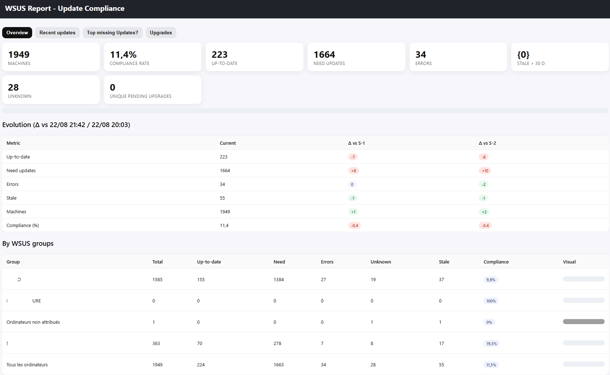
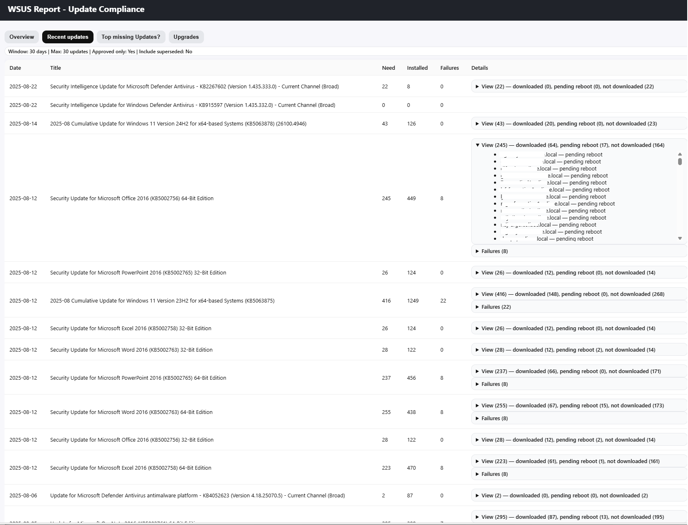
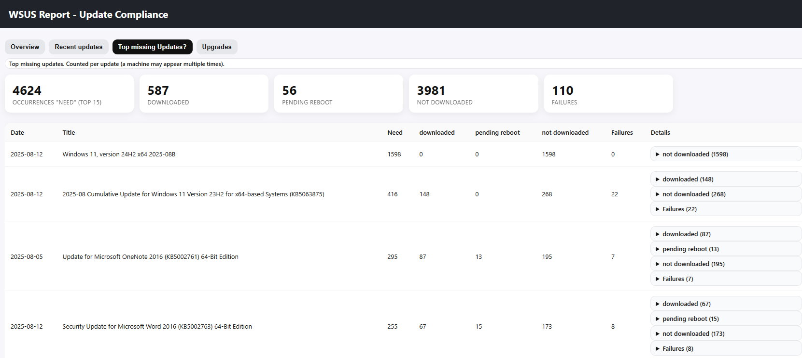

# WSUS PowerShell Script – Automated Reports (HTML, Email – FR/EN/ES)

> **Vitrine GitHub** – Le script complet est disponible à l'achat (usage commercial autorisé par EULA, redistribution interdite).  
> **Full script** available for purchase (commercial use allowed by EULA, redistribution forbidden).

**Keywords**: WSUS, PowerShell, report, HTML, email, multilingual, FR/EN/ES, sysadmin, Windows Server Update Services, automation, scheduled task, KPI, compliance

---

## What this script does
- Generates **WSUS compliance reports** (computers up-to-date / needing updates / errors)
- Exports **HTML** (ready for Excel/BI)
- Sends a **multilingual email** (FR / EN / ES) with attachments
- Designed for **scheduled runs** (Task Scheduler) and **enterprise environments**

👉 **Get the full script**: [Buy the complete PowerShell script](https://yanosh77.github.io/wsus-powershell-reports/)  

---

## Features
- **Universal**: Works across WSUS setups (no hard-coded server names)  
- **Multilingual**: Email body in **French, English, Spanish**  
- **KPIs included**: Up-to-date, need updates, errors (D-1 / D-7 deltas optional)  
- **Outputs**:  
  - `report.html` (responsive, email-friendly)  

---

## Screenshots (sample output)
Here are some previews of the generated reports:

- **Homepage view**  
  

- **Recent updates summary**  
  

- **Top missing updates**  
  

---

## Safe code excerpt (non-functional)
This file shows the **structure** and **coding style** only. The business logic is intentionally removed.

See: [`EXCERPT_Wsus-Reports.ps1`](EXCERPT_Wsus-Reports.ps1)

---

## How it works (high level)
1. Connects to WSUS API (PowerShell) and collects update/computer states  
2. Computes KPIs and deltas  
3. Renders HTML 
4. Sends a multilingual email with attachments  

---

## Quick start (for the full version)
1. Download the full script from the link above  
2. Edit the **SMTP** settings and recipients  
3. Run locally to validate output  
4. Schedule a **Task Scheduler** job (daily/weekly)  

---

## Licensing / EULA
- **Usage**: Allowed in personal or commercial environments per purchased license  
- **Redistribution**: **Forbidden**  
- See `EULA.txt` included in the paid package  

---

## Support & questions
- Open an **Issue** with details (WSUS version, OS build, PowerShell version, logs)  
- For commercial support or custom features, use the link in the purchase page  

---

## SEO notes (for robots and humans)
This page targets searches like:  
- *WSUS PowerShell report script*  
- *WSUS HTML CSV email report*  
- *PowerShell WSUS automation multilingual*  

> Tip: If you fork this, please credit & keep a link to the original page.

